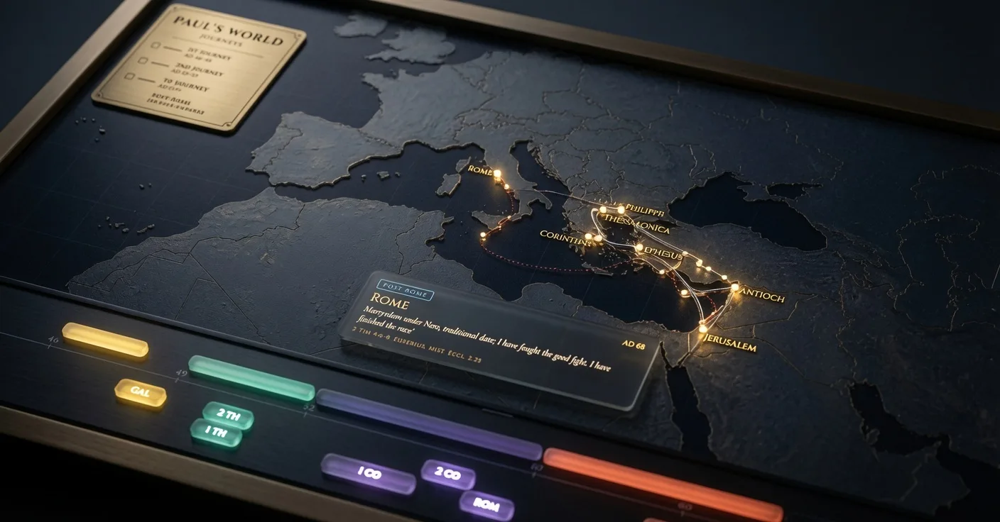
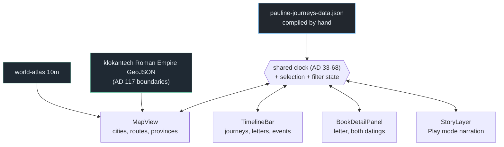

# Paul's World

An interactive atlas of the Pauline mission: a D3 map of 50 cities across the
Roman Mediterranean, a timeline running AD 33–68 through five journeys, and all
thirteen letters placed at the city and the year they were written from. Map and
timeline share one clock — scrub the timeline and the journey routes draw across
the map; select a letter and both surfaces move to where it was composed. Where
scholars disagree about a letter's date, origin or authorship, the data carries
*both* positions rather than picking one silently.

Built as a modelling exercise: the Pauline corpus is a travel itinerary, a
correspondence record and a contested scholarly reconstruction all at once, and
those three things want to be one dataset.



*Placeholder still. The routes draw progressively and the map pans in Play mode — a demo GIF replaces this.*

**Live → [pauls-world.vercel.app](https://pauls-world.vercel.app)**

---

## What it contains

| Layer | Count | Notes |
|---|---|---|
| **Cities** | 50 | Ancient name, modern name, Roman province, and a tier controlling label density |
| **Journeys** | 5 | First, Second and Third Missionary Journeys; the Journey to Rome; Post-Rome Ministry |
| **Letters** | 13 | The full corpus, each with a writing location, a date range and a recipient |
| **Church events** | 22 | Per-city founding, leadership, letters received, support |
| **Narrative beats** | 44 | Per-period events driving the Play-mode captions |
| **Span** | AD 33–68 | |

**The details that would have made it wrong:**

- **Six of the thirteen letters are flagged `debated` for authorship**, and seven
  `undisputed`. The app does not quietly present all thirteen as equally settled,
  because that is a position, not a neutral default.
- **Letters carry a second location and a second date.** Galatians is the clear
  case: South Galatia and an early date (AD 48–49, after the first journey and
  before the Jerusalem Council) against North Galatia and a late date (AD 53–55,
  from Ephesus during the third). Both are in the data with a note; the map can
  show either. Choosing one and hiding the other would have made a contested
  reconstruction look like a fact.
- **The province boundaries are AD 117, not AD 50.** The klokantech Roman Empire
  dataset represents Trajan's empire, which is the best public vector source but
  is roughly seventy years late for Paul. The differences are real and named —
  Lycia was joined to Pamphylia in AD 43, and several eastern provinces differ.
  Drawing Trajan's borders and labelling them "Paul's world" without saying so
  would produce a map that is plausible and wrong.
- **Cities carry `modernName`**, because "Philippi" locates nothing for most
  readers and "near Kavala, Greece" does.

---

## Architecture



The important edge: **every surface reads and writes the same state object rather
than talking to its neighbours.** A letter selected in the timeline moves the map
because both observe the clock, not because the timeline calls the map. That is
what makes the alternate-dating toggle cheap — flipping Galatians from the early
to the late reconstruction changes one value, and four components re-render
correctly without knowing the toggle exists.

---

## Quickstart

```bash
npm install
npm run dev
```

No API keys, no accounts, no runtime network calls. All data is committed.

---

## Using it

- **The timeline is a scrubber.** Drag it and routes extend across the map in
  step, so a journey reads as elapsed time rather than a finished line.
- **Letters sit on the timeline at the place they were written**, not at the
  place they were sent. That is the fact the corpus usually hides: Romans was
  written from Corinth, and the map says so.
- **Select a debated letter and both readings are shown.** The panel gives each
  date range, each candidate origin city, and the note explaining what turns on
  the choice.
- **Play mode narrates the whole arc** from the per-period beats, panning the map
  as the mission moves.
- **Cities are tiered**, so labels thin out as you zoom away instead of colliding
  into an unreadable mass around the Aegean.

---

## Data shape

```jsonc
{
  "dateRange": [33, 68],
  "cities":   [ /* 50 */ ],   // ancient + modern name, province, tier, coords
  "journeys": [ /* 5  */ ],   // ordered stop lists
  "books":    [ /* 13 */ ],   // the letters — see the key-name note below
  "churchEvents": [ /* 22 */ ],
  "paulEvents":   [ /* 44 */ ]
}
```

A letter carries both readings side by side:

```jsonc
{
  "name": "Galatians",
  "writingLocationId":  "antioch-syria",  // South Galatia / early
  "writingLocationAlt": "corinth",        // North Galatia / late
  "dateRange":    [48, 49],
  "dateRangeAlt": [53, 55],
  "dateDebated":  true,
  "dateNote":     "South Galatia/early date ... vs. North Galatia/late date ...",
  "attribution":  "undisputed"            // or "debated"
}
```

**`books` means the letters here.** The sister app *Jesus's World* shares this
rendering engine, where the same key means landmark events. The names were kept
identical so one engine serves both datasets; the trade is a key name that reads
oddly against a corpus of epistles.

---

## Project layout

```
src/
  data/
    pauline-journeys-data.json   the whole dataset; _readme carries the conventions
    PAULS-WORLD-APP-SPEC.md      the original build spec
    TIMELINE-*-SPEC.md           timeline disclosure and drill-down design notes
  components/
    MapView            D3 map — cities, routes, province fills
    TimelineBar        AD 33-68 scrubber; journeys, letters, events as tracks
    BookDetailPanel    a letter, with both datings when they are contested
    StoryLayer         Play mode: pan, caption, progressive route reveal
    PaulStopTrack      per-stop thread within a journey
    ChurchTrack        per-city event thread
```

---

## Methodology and limits

**The dates are a scholarly consensus, not a record.** The data file says so in
its own header, and every letter whose dating is contested carries the second
reading. Nothing here is a discovery; it is a published reconstruction made
inspectable.

**The province boundaries are seventy years late.** klokantech's dataset maps
Trajan's empire around AD 117. It is the best openly licensed vector source for
Roman provinces, and it is close enough for orientation, but it is not Paul's
political geography. Lycia was joined to Pamphylia in AD 43; several eastern
provinces differ. The dataset's own note records this and it is repeated here so
the map is not read as more precise than it is.

**Routes are illustrative paths, not itineraries.** Where Acts names a sequence
of ports the line follows them, but the actual sailing tracks, road choices and
stopovers are mostly unrecorded. A drawn line between two cities means "went from
here to there", not "took this route".

**Post-Rome Ministry is the most speculative period on the timeline.** It rests on
the Pastoral Epistles and on early tradition rather than on Acts, which ends
before it. It is included because the letters need somewhere to sit; treat it as
the weakest segment.

**What this is not.** Not a commentary, not a critical introduction, and not an
argument for any particular dating scheme. Where the field is split, the app shows
the split.

---

## Data sources

| Source | Used for | Access |
|---|---|---|
| [world-atlas](https://github.com/topojson/world-atlas) 10m | Coastlines and modern borders | npm |
| klokantech Roman Empire GeoJSON | Province boundaries (AD 117) | Public |
| Acts and the Pauline epistles | Itinerary, events, letter recipients | Public domain |
| Standard scholarly introductions | Date ranges, authorship attribution, alternate readings | Compiled by hand |

All committed — the app runs offline with no keys.
